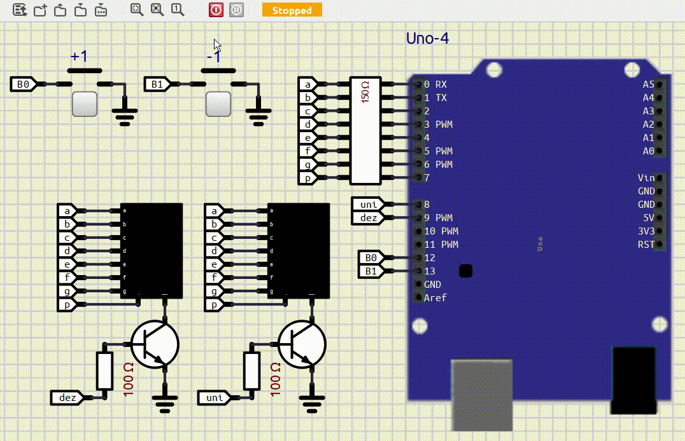

# 📟 Detecção de Bordas com AVR e Arduino

Este projeto consiste no desenvolvimento de um circuito com programação em AVR, para detectar as bordas de subida e descida em botão pulsador, gerando um incremento e decremento de uma variável de contagem no display de 7 segmentos. O funcionamento é o seguinte:

*Comportaemnto do circuito:*

Ao pressionar o botão "+1", o display deve incrementar o valor exibido, iniciando em 1 e podendo chegar até 99. Da mesma forma, ao pressionar o botão "-1", o valor no display deve ser decrementado, por exemplo, de 99 para 98, e assim sucessivamente.

🛠 Tecnologias e Componentes Utilizados:

| Componente            | Modelo                                                                                                                               | Descrição                                                                                                                                     |
| :-------------------- | :----------------------------------------------------------------------------------------------------------------------------------- | :-------------------------------------------------------------------------------------------------------------------------------------------- |
| Microcontrolador      | [AVR - ATMega328P](https://ww1.microchip.com/downloads/en/DeviceDoc/Atmel-7810-Automotive-Microcontrollers-ATmega328P_Datasheet.pdf) | Plataforma Arduino Uno como interface                                                                                                         |
| IDE                   | [MPLabX](https://www.microchip.com/en-us/tools-resources/develop/mplab-x-ide)                                                        | Ambiente de Desenvolvimento Integrado - [Instalação](https://developerhelp.microchip.com/xwiki/bin/view/software-tools/ides/x/install-guide/) |
| Compilador            | [XC8](https://www.microchip.com/en-us/tools-resources/develop/mplab-xc-compilers/xc8)                                                | [Instalação](https://developerhelp.microchip.com/xwiki/bin/view/software-tools/xc8/install/)                                                  |
| Editor de código      | [Visual Studio Code](https://code.visualstudio.com/)                                                                                | [v1.97.2](https://code.visualstudio.com/sha/download?build=stable&os=win32-x64-user)                         |
| Construtor de projeto | [Makefile](https://stackoverflow.com/questions/32127524/how-to-install-and-use-make-in-windows)                                      | Power Shell `winget install Chocolatey.Chocolatey` `choco install make`                                                                 |
| Gravador do AVR       | [AVRDudess](https://github.com/ZakKemble/AVRDUDESS/releases/tag/v2.18)                                                               | [ZakKemble/AVRDUDESS/v2.18](https://github.com/ZakKemble/AVRDUDESS/releases/download/v2.18/AVRDUDESS-2.18-setup.exe)                          |
| Simulador eletrônico  | [SimulIDE](https://simulide.com/p/downloads/)                                                                                        | Power Shell `winget install SimulIDE.SimulIDE`                                                                                             |
| Versionamento         | [git](https://git-scm.com/downloads)                                                                                                 | Power Shell `winget install --id Git.Git -e --source winget`                                                                               |

Este projeto faz parte de uma atividade acadêmica e tem como objetivo a aplicação prática de conceitos de eletrônica e programação embarcada.

🗺️ Mapa de entradas e saídas:

| Função  | Dispositivo       | Descrição                | Pino (Arduino Uno) | Pino (ATmega328P) | PORT |
| :------ | :---------------- | :------------------------| :----------------- | :-----------------|:-----|
| Saída   | Pino a            | Segmento "a" do Display  | 0                  | 2                 | PD0  |
| Saída   | Pino b            | Segmento "b" do Display  | 1                  | 3                 | PD1  |
| Saída   | Pino c            | Segmento "c" do Display  | 2                  | 4                 | PD2  |
| Saída   | Pino d            | Segmento "d" do Display  | 3                  | 5                 | PD3  |
| Saída   | Pino e            | Segmento "e" do Display  | 4                  | 6                 | PD4  |
| Saída   | Pino f            | Segmento "f" do Display  | 5                  | 11                | PD5  |
| Saída   | Pino g            | Segmento "g" do Display  | 6                  | 12                | PD6  |
| Saída   | Pino p            | Segmento "p" do Display  | 7                  | 13                | PD7  |
| Saída   | Comum Unidade     | Unidade do Display       | 8                  | 14                | PB0  |
| Saída   | Comum Dezena      | Dezena do Display        | 9                  | 15                | PB1  |
| Entrada | Botão Pulsador NA | B0 : incrementa contagem | 12                 | 18                | PB4  |
| Entrada | Botão Pulsador NA | B1 : incrementa contagem | 13                 | 19                | PB5  |

| 📟 Simulação no SimulIDE: |
|:----------------------------------------------------------------:|
|                       |
